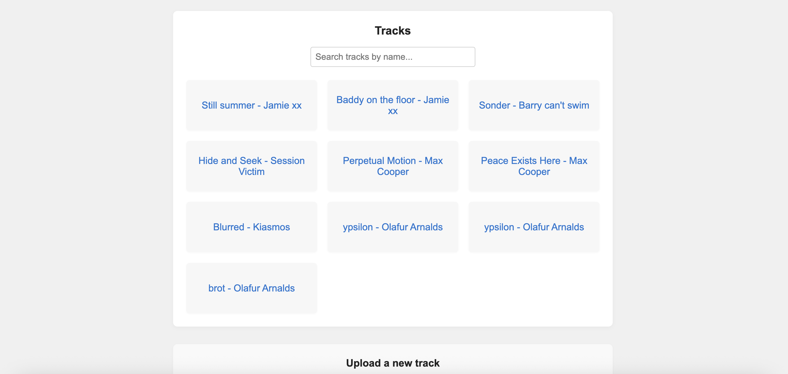

# Music library

A small experiment to play around with audio vector embeddings and Elasticsearch to create a simple music library of tracks and find similar tracks.

A form allows to upload a new audio file to index embeddings for this new track. The list then allows to search for and find similar tracks.

This project uses:
 - Python and fastAPI on the backend
 - React and TS on the frontend
 - Elasticsearch
 - librosa and PANNs inference to analyse audio and create embeddings

## How to run

Setup: 

```
uv sync
```

Backend API:

```
uvicorn lib.main:app --reload
```

Frontend:
```
cd web/
npm start
```

## Example screenshots


